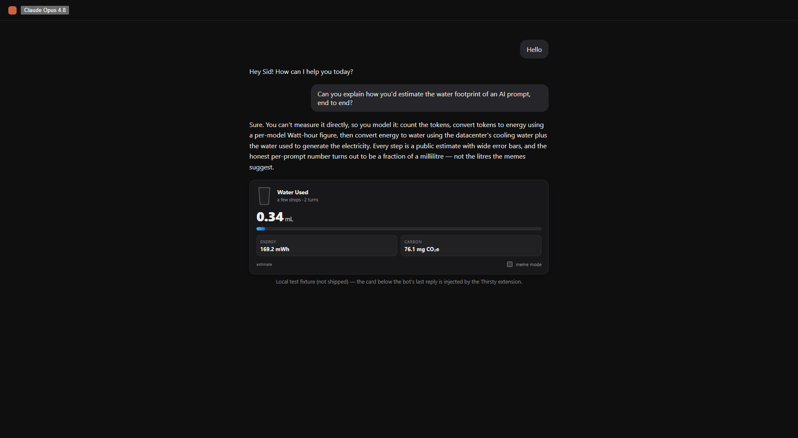
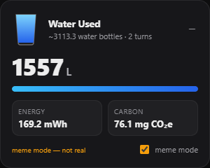

# 💧 Thirsty — an AI prompt-footprint meter

> _"Imagine if Claude showed us the amount of water used per prompt. 😭"_
> — [@immasiddx](https://x.com/immasiddx/status/2071969427340603814)

Thirsty turns that meme into a real, honest tool. It estimates the **water,
energy, and CO₂** behind an AI conversation and shows it inline — as a card in
the chat UI, a line in your Claude Code statusline, or a number in your own app.

|            Honest mode             |            Meme mode             |
| :--------------------------------: | :------------------------------: |
|  |  |
| the real number is _tiny_ (~0.3 mL) | reproduces the viral gag, labelled **not real** |

## The honest catch

You **cannot measure** per-prompt water — no vendor exposes it. So Thirsty
_models_ it, and the honest number turns out to be a rounding error, not a
tragedy. Credible 2025 figures: Google reported a median **~0.26 mL** per Gemini
text prompt; OpenAI's Altman quoted **~0.32 mL** per ChatGPT query. The viral
"46 litres for a Hello" is off by ~5–6 orders of magnitude. Building this
accurately basically _debunks_ the per-prompt doom — the real story is
**aggregate scale**, not any single message. Thirsty ships both the honest
tracker and a clearly-labelled `meme mode` so you can have the joke without the
lie.

## How the estimate works

```
tokens ──(model Wh/token)──▶ energy (Wh, ×PUE) ──(grid L/kWh)──▶ water (mL)
                                              └──(grid kgCO₂/kWh)─▶ carbon (g)
```

- **tokens** — exact from an API `usage` field or a Claude Code transcript;
  approximate (~4 chars/token) when we can only see on-screen text.
- **energy** — per-model Watt-hours/token (output weighted heavier — decoding is
  autoregressive). Triangulated from published per-prompt figures.
- **water** — on-site datacenter cooling (WUE) + off-site water to generate the
  electricity. This carries the biggest error bars, so it's a swappable profile.

Every coefficient is a documented, order-of-magnitude **estimate**, editable in
[`packages/core/src/profiles/`](packages/core/src/profiles/). Methodology owes to
UC Riverside's _"Making AI Less Thirsty"_ (Ren et al.).

## Architecture — one engine, many surfaces

It's a plug-in platform (npm workspaces), so new products/integrations drop in
without touching the engine:

```
packages/core/            @thirsty/core — the estimator + a pluggable registry
                          of provider & grid coefficient packs. Pure, no I/O.
surfaces/
  browser-extension/      MV3 extension — injects the "Water Used" card on claude.ai   [MVP ✓]
  cli/                    Claude Code statusline/hook — EXACT, from the transcript      [✓]
  api-wrapper/            server-side helper — footprint per request/tenant             [✓]
plugins/                  workspace glob — drop a coefficient pack or a new surface here
  provider-xai/           worked example: registers xAI Grok in ~15 lines
```

Adding a provider, a grid region, or a whole new surface never edits `core`.
See [`plugins/README.md`](plugins/README.md).

## Quick start

```bash
npm install
npm test                                   # 28 tests across core + every surface

# Browser extension (the MVP)
npm run build --workspace @thirsty/browser-extension
#   then load surfaces/browser-extension/ as an unpacked extension in Chrome,
#   or open surfaces/browser-extension/demo.html for a mock-claude.ai preview.

# Claude Code statusline (exact, from the session transcript)
npm run build --workspace @thirsty/cli     # see surfaces/cli/README.md to wire it up
```

## Status

MVP + platform scaffolding complete and verified. Roadmap in
[`.project/status.md`](.project/status.md). **Estimates only — not measurements.**
